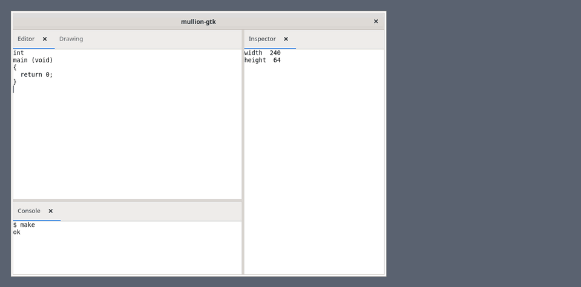

# mullion-gtk

Tiled panes for GTK 4 apps: a split tree of tabbed leaves, tabs dragged
to move or split, closed panes listed and reopened where they were, and
layouts kept and restored. It is the model of
[mullion](https://github.com/mishan/mullion), which does the same for a
web page, and it keeps layouts mullion can read and reads the ones
mullion keeps.



What is here (see [CHANGELOG.md](CHANGELOG.md) for what each release
brought):

- `src/mln-model.{h,c}`: the layout model, GLib only, ported one function
  to one function from mullion's `src/panes.js`.
- `src/mln-json.{h,c}`: the JSON a layout is kept as, read and written as
  `JSON.parse` and `JSON.stringify` do.
- `src/mln-panes.{h,c}`: `MlnPanes`, the widget: tab strips, dividers, the
  drawer, tab drags, mullion's keyboard chords, a tab menu.
- `demo/`: a window of four panes to try it on, and `record.py`, which
  records it for the GIF above.
- `tests/`: the model's operations, the JSON, and mullion's layout cases
  (`tests/layouts.json`, copied from mullion's `test/layouts.json`; keep
  the two the same).

## Floating windows

A pane can go into a window of its own: its tab menu's Move to New
Window, `mln_panes_undock`, or a tab dragged out of the window and let go
over nothing. Tabs drag between windows as within one, splits and all,
and closing a floating window puts what was in it back where it was in
the main window (remembered for the session, not kept with the layout).

The app can make the windows (`mln_panes_set_window_func`), and should
where its panes' menus name window actions; otherwise each is transient
for the main window and of its application. A window the app destroys
is made again; closing one docks it. They are kept with the layout, with
their sizes. Positions are not: Wayland does not give them, and X11's
are the window manager's.

## Tabs in the corner

`mln_panes_set_header (panes, MLN_HEADER_CORNER)` (the `header`
property) takes the tab strip off every leaf and puts its tabs over the
leaf's top corner, in sight while the pointer or the focus is in the leaf
or a tab is being dragged: the panes' icons (`mln_panes_set_icon`; the
title for a pane without one), a grip for a pane alone in its leaf, the
front pane's cross, and a button for its tab menu. They raise, drag, drop
and take the keys as a strip's tabs do; the pane has the whole leaf. In a
strip, an icon sits before the title.

Laid over the pane, the corner covers whatever its first row has at that
end. `mln_panes_get_corner_width` says how much, and `::corner-changed`
when that may have changed, for a pane that makes room (a margin on its
toolbar, say). A pane that has made room can keep its corner in sight
while it is in front, where it covers nothing: `mln_panes_set_corner_pinned`.
mullion's `header: 'corner'` and `setCornerPinned` are the same, for a web
page.

## What it adds to mullion's layouts

Fields mullion does not write and reads past, for what a desktop app
needs that a page does not:

- `"slots"` on a leaf: names for where a pane goes when nothing remembers
  where it was (`mln_panes_set_placement`). A leaf that empties hands its
  slots to the leaf that takes its room.
- `"floating"` in the envelope: the floating windows, each
  `{"layout":…,"size":[w,h]}`. mullion has none, and a layout kept with
  one is read by mullion as the main window's alone -- or, with no
  version, as no layout (below).
- `"closed"` in the envelope: the panes a person closed that the app opens
  wherever a layout does not have them, so that a pane new in a release
  comes up in a layout kept by the one before, and one a person closed
  stays closed.

They are written only when there are any, in the version's envelope where
the app gives a version and in one of their own (`{"layout":…}` with
them) where it does not. mullion reads that one as no layout.

A layout that uses none of them is written exactly as mullion writes it. One
kept by mullion has neither: a layout that goes through the web and back
comes back without its slots.

## Building

With meson:

```sh
meson setup build
meson test -C build
```

or with CMake:

```sh
cmake -S . -B build -G Ninja
cmake --build build && ctest --test-dir build
```

Either builds a static `libmullion-gtk-0` by default, installs
`mullion-gtk-0.pc` and the headers under `include/mullion-gtk-0/`, and
runs the same tests. `-Db_sanitize=address,undefined` is how the tests are
meant to be run.

The widget tests drive the demo in a real window with
[shotbox](https://github.com/mishan/shotbox), and are skipped without it:

```sh
pipx install --system-site-packages shotbox
```

or `pip install shotbox`. To run them against a shotbox checkout instead,
give it with `-Dshotbox=/path/to/shotbox` or `-DMLN_SHOTBOX=/path/to/shotbox`.

## Using it

It needs GTK 4.10 and GLib 2.74. Built into an app, it is a static
library and installs nothing.

From a meson project, as a subproject (`subprojects/mullion-gtk.wrap`):

```ini
[wrap-git]
url = https://github.com/mishan/mullion-gtk.git
revision = v0.2.1
depth = 1
```

```meson
mullion = dependency('mullion-gtk-0', fallback: ['mullion-gtk'])
executable('app', 'app.c', dependencies: mullion)
```

From CMake, with FetchContent (or `add_subdirectory` on a copy):

```cmake
include(FetchContent)
FetchContent_Declare(mullion-gtk
  GIT_REPOSITORY https://github.com/mishan/mullion-gtk.git
  GIT_TAG v0.2.1)
FetchContent_MakeAvailable(mullion-gtk)
target_link_libraries(app PRIVATE mullion-gtk::mullion-gtk)
```

Installed, it is `pkg-config mullion-gtk-0`, and `dependency('mullion-gtk-0')`
finds it without the fallback. Either way, include `mullion-gtk.h`.

### A window of panes

The app registers its panes by id, gives a default layout, and loads what
it kept last time:

```c
#include <mullion-gtk.h>

static const char *LAYOUT =
  "{\"dir\":\"row\",\"size\":[0.7,0.3],\"kids\":["
  "{\"tabs\":[\"editor\",\"preview\"]},"
  "{\"tabs\":[\"outline\"]}]}";

static void
activate (GtkApplication *app)
{
  GtkWidget *win = gtk_application_window_new (app);
  GtkWidget *panes = mln_panes_new ();

  /* An id, a title, the content, and the narrowest it may be. */
  mln_panes_register (MLN_PANES (panes), "editor", "Editor", gtk_text_view_new (), 240);
  mln_panes_register (MLN_PANES (panes), "preview", "Preview", gtk_picture_new (), 160);
  mln_panes_register (MLN_PANES (panes), "outline", "Outline", gtk_list_box_new (), 120);

  mln_panes_set_default (MLN_PANES (panes), "main", LAYOUT);
  mln_panes_set_mode (MLN_PANES (panes), "main");
  mln_panes_load (MLN_PANES (panes), NULL);  /* NULL: the default */

  gtk_window_set_child (GTK_WINDOW (win), panes);
  gtk_window_present (GTK_WINDOW (win));
}
```

A layout is a tree: a split has a `dir` (`row` or `col`), the `size` of
each kid as a fraction, and its `kids`; a leaf has its `tabs`, the first
in front. A pane the layout does not name is in the drawer.

### Keeping the layout

`::layout-kept` hands over the text to keep whenever the layout changes,
and NULL when it is reset; `mln_panes_load` takes it back. With
GSettings, say:

```c
static void
kept (MlnPanes *panes, const char *mode, const char *text, gpointer settings)
{
  g_settings_set_string (settings, "layout", text != NULL ? text : "");
}

  /* ... after registering the panes: */
  char *text = g_settings_get_string (settings, "layout");

  mln_panes_set_version (MLN_PANES (panes), "2");
  mln_panes_load (MLN_PANES (panes), *text != '\0' ? text : NULL);
  g_signal_connect (panes, "layout-kept", G_CALLBACK (kept), settings);
  g_free (text);
```

A kept layout that does not parse, or was kept under another version, is
passed over for the default: change the version when the default changes
enough that an old layout should not come back.

### Panes that come and go

```c
static void
discard (MlnPanes *panes, const char *id, gpointer data)
{
  g_object_unref (mln_panes_remove (panes, id));
}

/* Opened after the layout is up, beside the editor. An ephemeral pane is
   ended on ::pane-discard rather than closed to the drawer. */
mln_panes_add (panes, "search", "Search", search_widget, 160,
               MLN_PANE_EPHEMERAL, "editor");
g_signal_connect (panes, "pane-discard", G_CALLBACK (discard), NULL);

/* Brought to the front, out of the drawer if it was there, and focused. */
mln_panes_present (panes, "outline", TRUE);

/* A pane new in this release, put in the leaf whose "slots" name "side"
   wherever a kept layout does not have it. Before mln_panes_load. */
mln_panes_set_placement (panes, "terminal", "side", TRUE);
```

[`demo/demo.c`](demo/demo.c) uses the rest: icons, the corner, a pane's
own tab-menu items, floating windows made by the app.

## License

LGPL-2.1-or-later. See [COPYING](COPYING).
